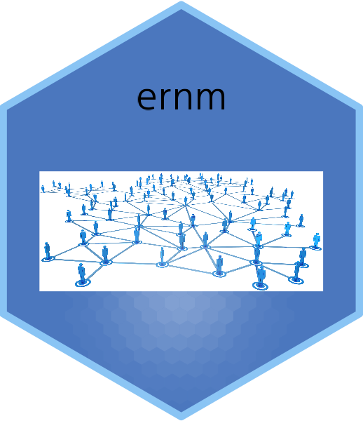
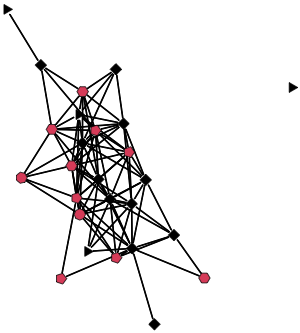
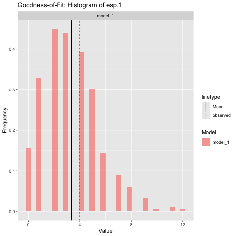

# The `ernm` package

This is an R package to fit Exponential-Family Random Network Models (ERNM).

Exponential-family Random Graph Models (ERGM) and Gibbs Fields are special cases of ERNMs and can also be estimated with the package. The package fits both fully and partially observed network data.

# Background

The stochastic processes generating complex social networks often involve stochastic nodal and dyadic variables that are endogenously related to the tie variables.
While exponential-family random graph models (ERGMs) have been very successful in modeling social
networks with exogenous covariates, they are often misspecified for networks where some covariates are stochastic.
Exponential-family random network models (ERNMs) retain the desirable properties of
ERGM, but allow the joint modeling of tie variables and covariates. For more information about the [`ergm`](https://github.com/statnet/ergm) package see [here](https://github.com/statnet/ergm).

`ernm` is an open-source R package  which enables ERNM to be fit to real-world network data.  The package implements likelihood-based inference, goodness-of-fit assessment and simulation of ERNM.
It also implements analogs of some of the many of the extensions that have been developed for ERGM, including tapered models. 

The package was developed by [Ian E. Fellows](https://fellstat.org) with support from Duncan A. Clark and Mark S. Handcock.

# Installation

The package is available on CRAN and can be installed using

```{r}
install.packages("ernm")
```

To install the latest development version from GitHub, the best way it to use git to create a local copy and install it as usual from there. If you just want to install it, you can also use:

```{r}
# If devtools is not installed:
# install.packages("devtools")

devtools::install_github("fellstat/ernm")
```

# Implementation

We will demonstrate simple use of the package using a real network. First we load package and network data.

```
library(ernm)
data(dutch_school)
```

`dutch_school` is a list of four networks collected in Knecht (2008). There are of students from a single class in the dataset collected at four time points at intervals of three months. The students are aged 11-13. Each node has values for age, ethnicity, religion and sex, as these are likely exogenous to the social process, we regard them as fixed for the purpose of this demonstration of analysis. There are also values 1 − 5 for alcohol use and delinquency from school, which we process as binary variables, with 1 indicating any alcohol or delinquency
behavior and 0 being none. Drinking alcohol and delinquency are likely endogenous to the social process of friendship within the class, thus, ERNM which treats them as such, is a suitable model. These variables are included as vertex attributes of the networks. We focus on the network at the third time point. 

As ERNM accounts for both stochastic edges and nodal covariates, network statistics can incorporate both. We analyze the third network, the second last network collected in the dataset, with the logic that the endogenous social process has had some time to reach some kind of stable state. We include edges, geometrically weighted edgewise shared partner (GWESP) and geometrically weighted degree (GWDEG) terms, with a fixed decay parameter. This is analogous to an ERGM analysis where the GWESP term accounts for transitivity in the network and the GWDEG term accounts for social popularity effects. The `nodeMatch` terms are the same as in ERGM, we note that these are applicable for both random nodal covariates and fixed nodal covariates.

There are other important control parameters, that are described in Fellows, Clark and Handcock (2025). 

The syntax is very similar to ERGM syntax with some slightly differently names terms for example `nodeMatch` in place of the `ergm` package `nodematch`. Full details can be found in Fellows, Clark and Handcock (2025) and the package documentation. Note that nodal covariates after the `|` symbol are regarded as random. Currently only discrete random variables are supported for nodal covariates.

We can make a quick visualization of the network, where the number of sides of the node is proportional to the level of alcohol use and the color is black if they do not use alcohol and black if they do.

```{r}
gplot(net, gmode="graph",
   vertex.sides=as.numeric(net %v% "alc")+3,
   vertex.col=as.numeric(net %v% "alc_bin")+1 )
```



## The `ernm()` function

The function that performs the overall maximum likelihood fit is called `ernm()`. This may take a few seconds to run.

```
set.seed(1)
net <- dutch_school[[3]]
model_1 <- ernm(net ~ edges +
gwesp(0.5) +
gwdegree(0.5) +
nodeCount('alc_bin') +
nodeCount('delinq_bin') +
nodeMatch('sex') +
nodeMatch('etnicity') +
nodeMatch('religion') +
nodeMatch('delinq_bin') +
nodeMatch('alc_bin') |
delinq_bin + alc_bin,
nodeSamplingPercentage = 0.5,
verbose = FALSE,
maxIter = 100,
tapered = FALSE)

model_1
```

    ##                           ERNM Model 
    ## Domain:
    ## Random graph = TRUE, Random variables = alc_bin delinq_bin
    ##                 edges  gwesp.0.5 gwdegree.0.5 nodecount.alc_bin.1
    ## Parameters  -7.075778   2.797428    0.3961009          -0.4465418
    ## Mean Values 96.821500 149.391420   39.4700129          11.0641000
    ##             nodecount.delinq_bin.1 nodematch.sex nodematch.etnicity
    ## Parameters              0.09320678      1.029239          0.1358498
    ## Mean Values            14.87130000     73.665600         80.2682000
    ##             nodematch.religion nodematch.delinq_bin nodematch.alc_bin
    ## Parameters           0.5576215            0.1920406        -0.1363803
    ## Mean Values         47.0953000           58.1278000        46.6376000

Here is a summary of the results of the fit:

```
summary.ernm(model_1)
```

    ##                                  theta        se          z      p.value
    ##     edges                  -7.07577801 1.2419221 -5.6974409 1.216191e-08
    ##     gwesp.0.5               2.79742793 0.7020541  3.9846332 6.758444e-05
    ##     gwdegree.0.5            0.39610090 0.8763979  0.4519647 6.512944e-01
    ##     nodecount.alc_bin.1    -0.44654185 0.5327333 -0.8382090 4.019133e-01
    ##     nodecount.delinq_bin.1  0.09320678 0.2383669  0.3910224 6.957807e-01
    ##     nodematch.sex           1.02923870 0.2153215  4.7800081 1.752881e-06
    ##     nodematch.etnicity      0.13584979 0.2468343  0.5503684 5.820667e-01
    ##     nodematch.religion      0.55762146 0.2112683  2.6393991 8.305313e-03
    ##     nodematch.delinq_bin    0.19204064 0.1068871  1.7966680 7.238833e-02
    ##     nodematch.alc_bin      -0.13638033 0.2364640 -0.5767489 5.641091e-01
    ##     
    ##     Information Criteria:
    ##           AIC      BIC
    ##      196.1945 234.8024


There is much more that can be down and we refer you to Fellows, Clark and Handcock (2025) for explanation and details.

Here is an assessment of the goodness-of-fit to the edgewise shared partner 1 statistic:

```
# Create histograms of summary statistics
gof_1 = ernm_gof(list(model_1=model_1),
observed_network = net,
style = 'histogram',
net ~ esp(1),
scale = 'free',
print = TRUE,
n_sim = 1000
)
```



We see that the fit to the statistic is good.

Again, this is just a start and we refer you to Fellows, Clark and Handcock (2025) for explanation and details.

## Adding Statistics

The preferred method for users to use their own custom statistics is to create a package as in the example extension package in `inst/examplePackage`.

Users can then directly call `register*Statistic` for statistics that may be useful for the wider community. 

They can be integrated into the `ernm` package the following workflow. This workflow also forces users to adequately test their statistics, which may be beneficial, especially for complex statistics.

1. Add to the `inst/include/stats.h` file. This is where the calculation of the statistics defined. Note for `ernm` the `dyadUpdate` and `discreteVertexUpdate` and `continVertexUpdate` methods are crucial for the performance of the MCMC routine required to fit ERNMs.
2. Register the statistic with the `src/statController.cpp` file
3. Add the statistic to the `test_stat.cpp` file. This will then be run when the package is built to ensure the statistic is safe on the C++ end 
4. Add `R` tests in `tests/testthat/test-stats.R` to actually check the value of the statistic is as expected on the `R` end.
5. Rebuild and install the package and use the statistics.

After these steps you should be able to add new statistics to your local fork of the `ernm` package, and then submit a pull request to have those statistics integrated into the `ernm` package for others to use.


# Resources

Please use the GitHub repository to report bugs or request features: [https://github.com/fellstat/ernm](https://github.com/fellstat/ernm)

See the following papers for more information and examples:

#### Statistical Methodology

* Fellows, I. E. and Handcock, M. S. (2012). *Exponential-family random network models*. [https://doi.org/10.48550/arXiv.1208.0121](https://doi.org/10.48550/arXiv.1208.0121)

* Fellows, I. E., Clark, D. A. and Handcock, M. S. (2025). *R package ernm: Exponential-family Random
Network Models*. Manuscript.

* Hunter, D. R., Handcock, M. S., Butts, C. T., Goodreau, S. M., and Morris, M. (2008). ergm: A package to fit, simulate and diagnose exponential-family models for networks. *Journal of Statistical Software, 24*(3), 1–29. [https://doi.org/10.18637/jss.v024.i03](https://doi.org/10.18637/jss.v024.i03)

* Knecht, A. B. (2008). *Friendship selection and friends’ influence: Dynamics of networks and actor attributes in early adolescence* (Doctoral dissertation, University of Utrecht, Utrecht, The Netherlands). 134 pages. [https://dspace.library.uu.nl/handle/1874/25950](https://dspace.library.uu.nl/handle/1874/25950)

* Wang, Z., Fellows, I. E., & Handcock, M. S. (2024). Understanding networks with exponential-family random network models. *Social Networks, 78*, 81–91. [https://doi.org/10.1016/j.socnet.2023.07.003](https://doi.org/10.1016/j.socnet.2023.07.003)